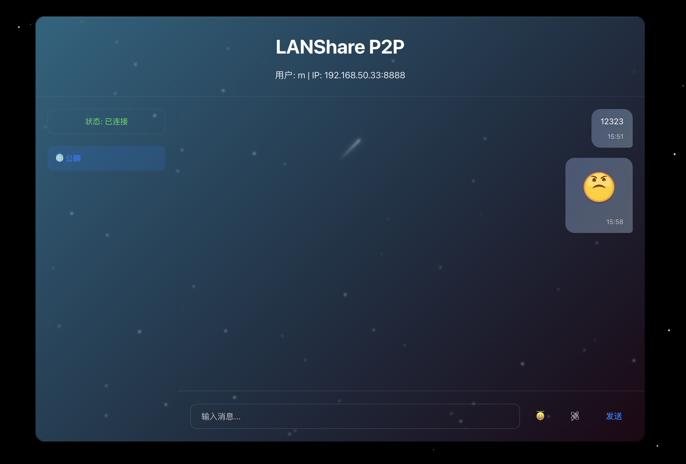

# LANShare P2P

一款去中心化的局域网即时通信工具，支持功能丰富的命令行和现代化的Web界面。



## 🌟 特性

- **P2P架构**: 无需中央服务器，节点间直接通信，保护隐私。
- **自动发现**: 零配置，自动发现并连接局域网中的其他客户端。
- **真正的单文件应用**: 所有Web界面资源（HTML, CSS, JS）均已嵌入可执行文件，部署极致简单。
- **双模式支持**: 
  - **命令行模式**：轻量、高效，适合服务器或终端爱好者。
  - **Web界面模式**：提供美观、直观的图形化界面，支持文件拖拽和弹窗交互。
- **实时聊天**: 支持群组公聊和点对点私聊。
- **完整的文件传输**: 
  - 支持通过命令行或Web界面发送任意路径下的文件。
  - 接收方会收到清晰的指令提示或**交互式弹窗**来决定是否接收。
- **跨平台**: 使用 `build.sh` 脚本可一键构建适用于 macOS, Linux, Windows 等多个平台版本。

## 🚀 快速开始

### 1. 构建

项目依赖 Go 1.16+ (需要 `embed` 包支持)。

```bash
# 推荐使用脚本一键构建所有平台
./build.sh
```
编译后的可执行文件会存放在 `build/` 目录下。脚本还会为你的当前系统创建一个名为 `lanshare` 的快捷方式在 `build/` 目录中。

### 2. 运行

```bash
# 启动程序 (在Linux/macOS上)
./build/lanshare

# 在Windows上
.\build\lanshare.exe

# 如果希望指定用户名启动
./build/lanshare -name 张三

# 查看所有启动选项
./build/lanshare -help
```

## 📖 使用说明

### 命令行模式

- `/to <用户名> <消息>` - 发送私聊消息。
- `/list` - 查看在线用户。
- `/name <新名称>` - 更改你的用户名 (所有人都将看到更新)。
- `/web` - 打开Web界面。
- `/webstop` - 停止web服务。
- `/send <用户名> <文件路径>` - 发送文件给指定用户。
- `/accept <文件ID>` - 接受一个待处理的文件传输。
- `/reject <文件ID>` - 拒绝一个待处理的文件传输。
- `/transfers` - 查看当前文件传输的状态列表。
- `/quit` - 退出程序。

## 故障排除

1. **无法发现其他用户**:
   - 确认所有设备连接在**同一个局域网**下（例如同一个Wi-Fi）。
   - 检查电脑的**防火墙**设置，确保它没有阻止程序进行网络通信 (特别是UDP 9999端口)。
2. **Web界面无法访问**:
   - 确认 `8080` 端口没有被其他程序占用。
3. **文件传输失败**:
   - 确认接收方有足够的磁盘空间。
   - 检查发送方对文件是否有读取权限。

---

## 其他

[emoji来源](https://github.com/goforbg/telegram-emoji-gifs)

**LANShare P2P** - 让局域网通信更简单！


